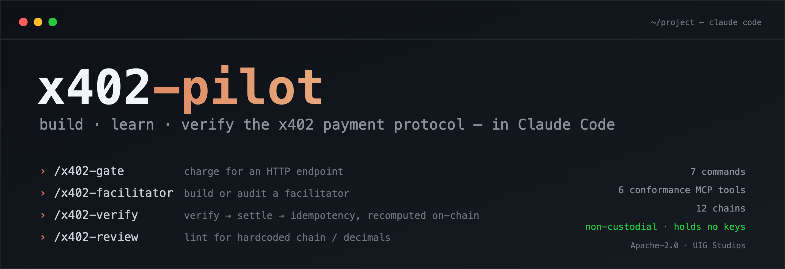

# x402-pilot



[](https://github.com/DrVelvetFog/x402-pilot/actions/workflows/skills.yml)
[](CHANGELOG.md)
[](LICENSE)
[](https://docs.claude.com/en/docs/claude-code)
[](https://github.com/x402-foundation/x402)

**7 commands · 6 conformance MCP tools · offline spec corpus across 12 chains · non-custodial (holds no keys, signs nothing).**

**The developer-assistant for the [x402](https://github.com/x402-foundation/x402) payment protocol** — a Claude Code plugin that bundles the x402 spec surface and gives your agent the context and workflows to *build, learn, and verify* x402 code.

x402-pilot is the **build/learn/verify** companion to the official **runtime** package [`@x402/mcp`](https://www.npmjs.com/package/@x402/mcp). It does not move money or pay for tools — it helps you write x402 integrations, facilitators, schemes, and extensions, and check them against the spec.

> Why this exists: x402 settles real value, and a capable model already knows much of the protocol — but *"the model probably remembers"* isn't good enough when money moves. x402-pilot makes the spec the **source of truth** (offline, version-pinned) and adds **executable, non-custodial conformance tools that verify rather than recall** — recompute a settlement against the on-chain balance change, run verify→settle→idempotency against a facilitator, lint a codebase for hardcoded chain/decimals. The corpus keeps you current as the protocol moves; the tools are right regardless of what any model remembers.

## What's inside

| Piece | Status |
|---|---|
| **Bundled spec corpus** — 77 files: protocol v1/v2, transports (http/mcp/a2a), `exact` scheme across 12 chains (EVM, Sui, SVM, Aptos, TON, NEAR, Stellar, Hedera, Algorand, Concordium, Cardano, Keeta), other scheme families, extension specs, authoring templates, SDK READMEs | ✅ Phase 0 |
| **Routing agent** (`agents/x402-pilot-agent.md`) — routes a topic to the right corpus; carries the contribution rules + facilitator-implementation lessons | ✅ Phase 0 |
| **`llms.txt`** — AI entry-point manifest | ✅ Phase 0 |
| **Commands / skills** — `/x402-pilot`, `/x402-gate`, `/x402-facilitator`, `/x402-scheme`, `/x402-extension`, `/x402-review`, `/x402-verify` | ✅ Phase 1 |
| **Conformance MCP** ([`mcp/x402-conformance-mcp`](mcp/x402-conformance-mcp/)) — `decode_402`, `inspect_payment_response` (with on-chain net-balance truth check), `check_compliance`, `lint_scheme_spec`, `validate_extension`, `run_conformance`. Non-custodial: holds no keys. | ✅ Phase 2 |
| **Evals** ([`evals/`](evals/)) — 7 stale-training tasks, `baseline` vs `pilot` A/B, auto-scored to HTML. Built & validated; run with budget. | ✅ Phase 3 |

See [SCOPE.md](SCOPE.md) for the full plan.

## Quick start

**Install it** (Claude Code v2.1+) — add this repo as a marketplace, then install the plugin:

```shell
/plugin marketplace add DrVelvetFog/x402-pilot
/plugin install x402-pilot@uig-studios
```

Or **try it for one session** without installing — clone the repo and launch:

```bash
claude --plugin-dir ./x402-pilot
```

**Use it.** The plugin adds these commands (namespaced under `x402-pilot:`):

| You want to… | Command |
|---|---|
| Charge for an HTTP endpoint | `/x402-pilot:x402-gate` |
| Build or audit a facilitator | `/x402-pilot:x402-facilitator` |
| Author a new-chain / new scheme spec | `/x402-pilot:x402-scheme` |
| Work with an extension (offers/receipts, gas-sponsoring) | `/x402-pilot:x402-extension` |
| Review x402 code for spec-compliance | `/x402-pilot:x402-review` |
| Run verify→settle→idempotency against a facilitator | `/x402-pilot:x402-verify` |
| Get oriented / route a question | `/x402-pilot:x402-pilot` |

**Worked example — charge for your API in 3 steps:**

1. In your project, run **`/x402-pilot:x402-gate`**.
2. Answer the prompts (framework, chain, asset, price, facilitator). It reads the live spec and scaffolds a compliant paywall — the price goes in as **atomic units, never a hardcoded decimal**.
3. Run **`/x402-pilot:x402-verify`** and give it your facilitator URL to prove the flow end-to-end.

The **conformance MCP** (`mcp__x402-conformance__*`) loads automatically with the plugin — your agent can decode a 402, recompute a settlement against the on-chain balance change, or lint a codebase for hardcoded chain/decimals with no extra setup.

<details>
<summary><strong>Under the hood:</strong> the bundled corpus is searched directly (no precomputed index)</summary>

The agent searches the bundled specs before generating code:

```
Glob  .x402-specs/schemes/exact/scheme_exact_*.md     # find the chain specs
Grep  "PAYMENT-RESPONSE"  .x402-specs/                 # find where a concept is defined
```
</details>

## Ecosystem

x402-pilot is the **build/learn/verify** layer of a larger x402-on-Sui stack — all built by the same author:

| Repo | What it is |
|---|---|
| [**sui-x402-facilitator**](https://github.com/DrVelvetFog/sui-x402-facilitator) | The first x402 facilitator on Sui — non-custodial, live on mainnet. The *runtime* x402-pilot teaches you to build. |
| [**x402-sui-stack**](https://github.com/DrVelvetFog/x402-sui-stack) | The builder front door: facilitator + tooling + a one-command demo that settles a real payment on Sui mainnet. |
| [**x402-charging-agent**](https://github.com/DrVelvetFog/x402-charging-agent) | A reference agent — an EV that pays for its own charge over x402 with usage-metered `upto` billing and on-chain settlement receipts. |

## Contributing & security

PRs welcome — see [CONTRIBUTING.md](CONTRIBUTING.md) for the contribution rules (the corpus is synced from upstream, never hand-edited) and [SECURITY.md](SECURITY.md) for how to report a vulnerability. All conduct is governed by the [Code of Conduct](CODE_OF_CONDUCT.md).

## Provenance & license

x402-pilot (agent, commands, skills, MCP, scripts) is original work by **UIG Studios LLC**, Apache-2.0.

The bundled `.x402-specs/`, `.x402-docs/`, and `.x402-sdk-docs/` are copied from the [x402 project](https://github.com/x402-foundation/x402) (© Coinbase, Apache-2.0) for local developer assistance — see [NOTICE](NOTICE). Refresh them with [`sync-specs.sh`](sync-specs.sh).

Built by the author of the [first x402 facilitator on Sui](https://github.com/DrVelvetFog/sui-x402-facilitator).
